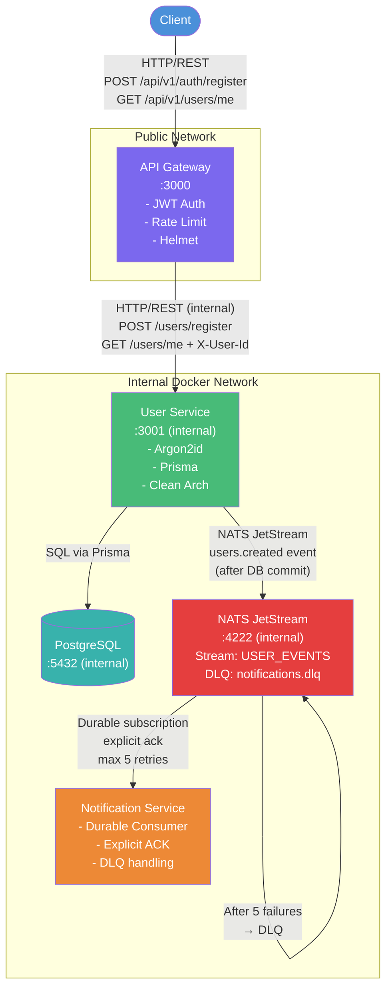

# Microservices Monorepo

A production-ready, scalable microservices system built with Node.js 22, TypeScript strict mode, Fastify, NATS JetStream, PostgreSQL/Prisma, and Docker Compose.

---

## Architecture

```
Client (HTTP)
     │
     │  HTTP/REST (public)
     ▼
┌─────────────┐
│ API Gateway │  Port 3000 (only publicly exposed port)
│  - JWT auth │
│  - Rate limit│
│  - Helmet   │
└─────┬───────┘
      │
      │  HTTP/REST (internal Docker network only)
      ▼
┌─────────────────┐       ┌──────────────┐
│  User Service   │──────▶│  PostgreSQL  │
│  - Argon2id     │       │  (users DB)  │
│  - Prisma ORM   │       └──────────────┘
│  - Clean Arch   │
└────────┬────────┘
         │
         │  NATS JetStream (users.created event)
         │  ← Asynchronous, NOT HTTP ─────────────
         ▼
┌──────────────┐
│     NATS     │  Stream: USER_EVENTS
│  JetStream   │  Consumer: notification-service-consumer (durable)
└──────┬───────┘
       │
       │  NATS subscription (explicit ack)
       ▼
┌─────────────────────────┐
│  Notification Service   │
│  - Durable consumer     │
│  - Explicit ACK         │
│  - Retry (maxDeliver=5) │
│  - DLQ (notifications.dlq)
└─────────────────────────┘
```

### Communication Rules

| From                | To                   | Protocol         |
|---------------------|----------------------|------------------|
| Client              | API Gateway          | HTTP/REST        |
| API Gateway         | User Service         | HTTP/REST (internal) |
| User Service        | Notification Service | **NATS JetStream only** |
| Notification Service | User Service        | ❌ Never         |
| Any service         | Any service          | ❌ No WebSockets |

---

## Monorepo Structure

```
/
├── apps/
│   ├── gateway/                  # API Gateway
│   │   ├── src/
│   │   │   ├── auth/jwt.ts       # JWT verification
│   │   │   ├── clients/          # HTTP client for User Service
│   │   │   ├── config/env.ts     # Env validation
│   │   │   ├── middleware/       # Error handler
│   │   │   ├── routes/           # auth, users, health
│   │   │   ├── server.ts
│   │   │   └── index.ts
│   │   ├── Dockerfile
│   │   └── package.json
│   │
│   ├── user-service/             # User Service (Clean Architecture)
│   │   ├── src/
│   │   │   ├── config/env.ts
│   │   │   ├── domain/           # User model, domain errors
│   │   │   ├── application/      # Use cases, schemas
│   │   │   │   └── use-cases/    # register-user, get-user-profile
│   │   │   ├── infrastructure/
│   │   │   │   ├── auth/jwt.ts   # JWT signing
│   │   │   │   ├── database/     # Prisma client singleton
│   │   │   │   ├── messaging/    # NATS client + publisher
│   │   │   │   └── repositories/ # PrismaUserRepository
│   │   │   ├── http/
│   │   │   │   ├── middleware/   # Error handler
│   │   │   │   └── routes/       # users, health
│   │   │   ├── server.ts
│   │   │   └── index.ts
│   │   ├── Dockerfile
│   │   └── package.json
│   │
│   └── notification-service/     # Notification Service (NATS consumer)
│       ├── src/
│       │   ├── config/env.ts
│       │   ├── handlers/         # user-created-handler
│       │   ├── messaging/        # NATS consumer with DLQ
│       │   ├── providers/        # NotificationProvider interface + Mock
│       │   └── index.ts
│       ├── Dockerfile
│       └── package.json
│
├── packages/
│   ├── contracts/                # Shared event schemas (Zod)
│   │   └── src/
│   │       ├── constants.ts      # Subjects, streams, consumers
│   │       ├── events/user-created.ts
│   │       └── index.ts
│   ├── shared/                   # Logger, errors, utilities
│   └── config/                   # Env validation factory
│
├── prisma/
│   ├── schema.prisma
│   └── migrations/
│       └── 20240101000000_init/migration.sql
│
├── docs/
│   └── openapi.yaml
│
├── docker-compose.yml
├── package.json
├── pnpm-workspace.yaml
├── tsconfig.json
├── .env.example
├── .gitignore
└── README.md
```

---

## Prerequisites

- **Docker** 24+ and **Docker Compose** v2
- **Node.js** 22+ (for local development)
- **pnpm** 9+ (`npm install -g pnpm`)

---

## Quick Start

### 1. Clone and configure

```bash
git clone <repo-url>
cd microservices-monorepo
cp .env.example .env
```

**Edit `.env` and set a strong JWT secret:**

```bash
# Minimum 32 characters
JWT_SECRET=your-super-secret-jwt-key-change-in-production-min-32-chars
```

### 2. Start with Docker Compose

```bash
docker compose up --build
```

This starts:
1. **postgres** — waits for health check
2. **nats** — with JetStream enabled and file storage
3. **db-migrate** — runs Prisma migrations, then exits
4. **user-service** — starts after migration completes
5. **notification-service** — starts after NATS is healthy
6. **gateway** — starts after user-service is healthy

### 3. Verify everything is up

```bash
curl http://localhost:3000/health
# {"status":"ok","service":"api-gateway","timestamp":"..."}

curl http://localhost:3000/ready
# {"status":"ready","service":"api-gateway","timestamp":"..."}
```

---

## API Usage

### Register a user

```bash
curl -X POST http://localhost:3000/api/v1/auth/register \
  -H "Content-Type: application/json" \
  -d '{
    "name": "Alice Smith",
    "email": "alice@example.com",
    "password": "securepassword123"
  }'
```

**Response (201):**
```json
{
  "user": {
    "id": "550e8400-e29b-41d4-a716-446655440000",
    "name": "Alice Smith",
    "email": "alice@example.com",
    "createdAt": "2024-01-15T10:30:00.000Z"
  },
  "accessToken": "eyJhbGciOiJIUzI1NiIsInR5cCI6IkpXVCJ9..."
}
```

### Get your profile

```bash
TOKEN="eyJhbGciOiJIUzI1NiIsInR5cCI6IkpXVCJ9..."

curl http://localhost:3000/api/v1/users/me \
  -H "Authorization: Bearer $TOKEN"
```

**Response (200):**
```json
{
  "id": "550e8400-e29b-41d4-a716-446655440000",
  "name": "Alice Smith",
  "email": "alice@example.com",
  "createdAt": "2024-01-15T10:30:00.000Z"
}
```

### Error responses

```bash
# 409 — duplicate email
curl -X POST http://localhost:3000/api/v1/auth/register \
  -H "Content-Type: application/json" \
  -d '{"name":"Alice","email":"alice@example.com","password":"password123"}'

# 401 — missing auth
curl http://localhost:3000/api/v1/users/me

# 400 — validation error
curl -X POST http://localhost:3000/api/v1/auth/register \
  -H "Content-Type: application/json" \
  -d '{"name":"A","email":"not-an-email","password":"short"}'
```

---

## NATS Event Contract

### Stream: `USER_EVENTS`
### Subject: `users.created`

```json
{
  "eventId": "550e8400-e29b-41d4-a716-446655440001",
  "eventType": "user.created",
  "occurredAt": "2024-01-15T10:30:00.000Z",
  "version": 1,
  "data": {
    "userId": "550e8400-e29b-41d4-a716-446655440000",
    "email": "alice@example.com",
    "name": "Alice Smith"
  }
}
```

> ⚠️ **SECURITY**: The password hash is **never** included in any event.

---

## Retry / DLQ Flow

```
Message arrives on users.created
         │
         ▼
  [Validate payload with Zod]
         │
    ✓ Valid ──────────────────▶ [Send notification]
         │                              │
    ✗ Invalid                     ✓ Success ──▶ msg.ack() ──▶ DONE
         │                              │
         ▼                         ✗ Failure
      msg.nak()                        │
         │                         msg.nak()
         ▼                             │
  [JetStream redelivers                ▼
   after ackWait=30s]       [JetStream redelivers
         │                   after ackWait=30s]
         │                             │
         ▼                             ▼
  delivery count++           delivery count++
         │                             │
  deliveryCount == maxDeliver (5)?
         │
         Yes
         │
         ▼
  [JetStream advisory: exceeded maxDeliver]
  [Operator publishes failed msg to notifications.dlq]
         │
         ▼
  DEAD LETTER QUEUE (notifications.dlq stream)
  — inspect, alert, or replay manually
```

**Key guarantees:**
- Messages are **never lost** (durable consumer + file storage)
- **No infinite loops** — maxDeliver cap enforced by JetStream
- ACK only on success — prevents premature removal
- DLQ allows post-mortem inspection

---

## Authentication Flow (JWT)

```
Client ──POST /api/v1/auth/register──▶ Gateway
                                          │
                                    [Validate body]
                                          │
                                  ──POST /users/register──▶ User Service
                                                                │
                                                         [Hash password (Argon2id)]
                                                         [Create user in PostgreSQL]
                                                         [Publish user.created to NATS]
                                                         [Sign JWT (sub=userId)]
                                                                │
                                          ◀──{user, accessToken}──
                                          │
Client ◀──201 {user, accessToken}──────────

Client ──GET /api/v1/users/me──▶ Gateway
  Authorization: Bearer <JWT>        │
                                [Verify JWT signature]
                                [Check expiry]
                                [Extract sub=userId]
                                      │
                              ──GET /users/me──▶ User Service
                                X-User-Id: <userId>    │
                                                 [Fetch profile by userId]
                                                        │
                              ◀──{profile}──────────────
                                      │
Client ◀──200 {profile}───────────────
```

**Identity propagation security:**
- The Gateway is the only JWT verifier
- User Service trusts `X-User-Id` header because it is not publicly accessible
- Client-provided user IDs are never used

---

## Environment Variables

| Variable               | Service              | Description                           | Default               |
|------------------------|----------------------|---------------------------------------|-----------------------|
| `GATEWAY_PORT`         | Gateway              | HTTP port                             | `3000`                |
| `JWT_SECRET`           | Gateway, User Service| HS256 signing secret (min 32 chars)   | **required**          |
| `JWT_EXPIRES_IN`       | Gateway              | Token TTL                             | `7d`                  |
| `USER_SERVICE_URL`     | Gateway              | Internal URL to User Service          | `http://user-service:3001` |
| `RATE_LIMIT_MAX`       | Gateway              | Max requests per window               | `100`                 |
| `RATE_LIMIT_TIME_WINDOW`| Gateway             | Rate limit window (ms)                | `60000`               |
| `USER_SERVICE_PORT`    | User Service         | HTTP port                             | `3001`                |
| `DATABASE_URL`         | User Service         | PostgreSQL connection string          | **required**          |
| `NATS_URL`             | All                  | NATS server URL                       | `nats://nats:4222`    |
| `NATS_STREAM_NAME`     | User Service, Notif  | JetStream stream name                 | `USER_EVENTS`         |
| `NATS_CONSUMER_NAME`   | Notification Service | Durable consumer name                 | `notification-service-consumer` |
| `NATS_MAX_DELIVER`     | Notification Service | Max delivery attempts before DLQ      | `5`                   |
| `NATS_ACK_WAIT_SECONDS`| Notification Service | Wait before redelivery (seconds)      | `30`                  |
| `POSTGRES_USER`        | PostgreSQL           | DB username                           | `postgres`            |
| `POSTGRES_PASSWORD`    | PostgreSQL           | DB password                           | `postgres`            |
| `POSTGRES_DB`          | PostgreSQL           | Database name                         | `userdb`              |
| `NODE_ENV`             | All                  | Environment                           | `development`         |
| `LOG_LEVEL`            | All                  | Pino log level                        | `info`                |

---

## Local Development

```bash
# Install dependencies
pnpm install

# Generate Prisma client
pnpm db:generate

# Run migrations (requires local PostgreSQL)
pnpm db:migrate

# Run all services in watch mode
pnpm dev
```

---

## Testing

```bash
# Run all tests
pnpm test

# Run with coverage
pnpm test:coverage

# Run a specific workspace
pnpm --filter @ms/user-service test
pnpm --filter @ms/gateway test
pnpm --filter @ms/notification-service test
```

Tests cover:
- ✅ JWT verification (valid, expired, wrong secret, malformed)
- ✅ User registration (success, duplicate email, password hashing)
- ✅ Profile retrieval (success, not found)
- ✅ Event publishing (success, DB failure prevents publish)
- ✅ Password never in events
- ✅ NATS message handling (ack, nak, retry, DLQ)
- ✅ Payload validation (valid, invalid, malformed JSON)
- ✅ Gateway route validation

---

## Security

| Concern                      | Implementation                              |
|------------------------------|---------------------------------------------|
| Password storage             | Argon2id (64MB memory, 3 iterations)        |
| JWT signing                  | HS256 with env-sourced secret               |
| JWT verification             | Timing-safe comparison, expiry check        |
| Secrets in code              | ❌ Never — all from `.env`                  |
| Passwords in events          | ❌ Never — excluded from `user.created`     |
| Passwords in logs            | ❌ pino redact configured                   |
| Rate limiting                | `@fastify/rate-limit` on Gateway            |
| Secure headers               | `@fastify/helmet` on all HTTP services      |
| CORS                         | Restricted in production                    |
| Internal service exposure    | User Service port not published to host     |
| Input validation             | Zod on all incoming data                    |

---

## Mermaid Architecture Diagram



---

## Why User Service → Notification Service is NATS-only

The requirement mandates that User Service and Notification Service communicate **exclusively through NATS JetStream**. This is enforced architecturally:

1. **No HTTP client** in User Service points to Notification Service
2. **No HTTP server** is started by Notification Service
3. Notification Service **only** connects to NATS; it never receives HTTP calls
4. User Service publishes to NATS **after** the DB transaction commits — fire and forget
5. Notification Service **independently** consumes from NATS — fully decoupled
6. The Docker Compose file exposes **no HTTP port** for Notification Service

This gives us:
- **Temporal decoupling**: Notification Service can be down when registration happens — it catches up when it restarts
- **Reliability**: JetStream persists messages on disk until ACK'd
- **Scalability**: Multiple Notification Service instances can consume from the same durable consumer group
